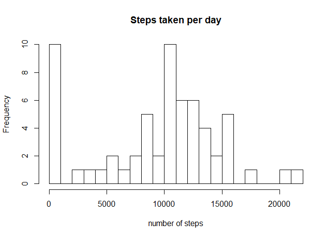
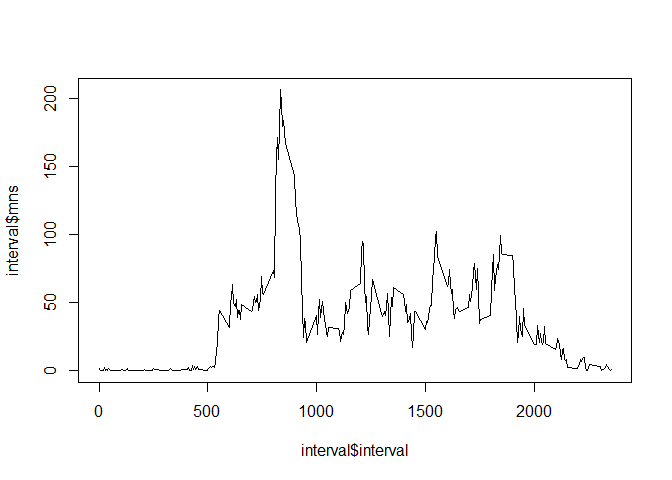
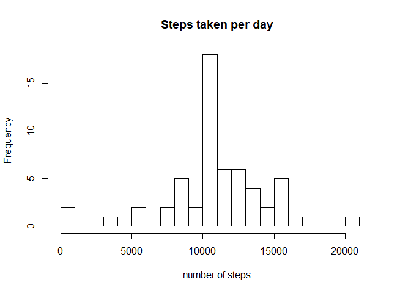
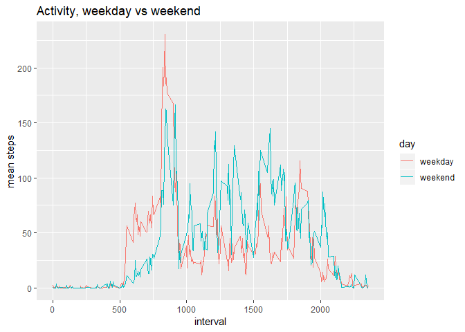

Load packages and data, changing date to correct format


```r
library(dplyr)
```

```
## 
## Attaching package: 'dplyr'
```

```
## The following objects are masked from 'package:stats':
## 
##     filter, lag
```

```
## The following objects are masked from 'package:base':
## 
##     intersect, setdiff, setequal, union
```

```r
library(xtable)
library(knitr)
library(ggplot2)
activity <- as.tbl(read.csv("activity.csv", stringsAsFactors = FALSE))
activity$date <- as.Date(activity$date)
```

Histogram and high level summary of the data:

```r
# use group_by() and summarise() to generate total steps per day
total <- activity %>% group_by(date) %>% summarise(total = sum(steps, na.rm = TRUE))
# Plot histogram
hist(total$total, main = "Steps taken per day", xlab = "number of steps", breaks = 20)
```

<!-- -->

```r
#generate statistics of grouped data
Statistic <- c("Mean","Median")
Sample <- c(round(mean(total$total),2), round(median(total$total),2))
table <- data.frame(Statistic,Sample)
rownames(table) <- NULL
kable(table)
```


Statistic      Sample
----------  ---------
Mean          9354.23
Median       10395.00

Mean steps taken by interval (over the course of each day)

```r
# use group_by() and summarise() to generate mean steps per interval
interval <- activity %>% group_by(interval) %>% summarise(mns = mean(steps, na.rm = TRUE))
# plot mean steps per interval
plot(x = interval$interval, y = interval$mns, type = "l")
```

<!-- -->

```r
# find interval with the highest step count
print(paste("The interval with the most steps is", interval$interval[which.max(interval$mns)]))
```

```
## [1] "The interval with the most steps is 835"
```

Imputing missing values with mean value for each interval.

```r
# find number of missing values
print(paste("The total number of missing values in 'steps' is", sum(is.na(activity$steps))))
```

```
## [1] "The total number of missing values in 'steps' is 2304"
```

```r
# use group_by() and summarise() to generate mean steps per interval
impute <- activity %>% group_by(interval) %>% summarise(mns = mean(steps, na.rm = TRUE))
activimp <- activity
#function to replace missing values with mean for that interval
repl <- function(x){
        
        for (i in seq_along(x)){
                if (is.na(x[i]) == FALSE) next
                x[i] <- impute$mns[which(impute$interval == activity$interval[i])]
        }
        x
}
activimp$steps <- repl(activimp$steps)

#repeat of summary chunk with new values
total <- activimp %>% group_by(date) %>% summarise(total = sum(steps, na.rm = TRUE))
hist(total$total, main = "Steps taken per day", xlab = "number of steps", breaks = 20)
```

<!-- -->

```r
Statistic <- c("Mean","Median")
Sample <- c(round(mean(total$total),2), round(median(total$total),2))
table <- data.frame(Statistic,Sample)
rownames(table) <- NULL
kable(table)
```


Statistic      Sample
----------  ---------
Mean         10766.19
Median       10766.19

The values and histogram differ from the original dataset. Given that I've used the mean to fill in missing values, its not suprising that these have now become the median values.

The histogram shows that the frequency of 0 values have decreased in favour of a higher frequency around the mean.


```r
#generate new column with weekend and weekday factors
weekend <- c("Saturday", "Sunday")
activimp <- activimp %>% mutate(day = if_else(weekdays(activimp$date) %in% weekend, "weekend", "weekday"))
activimp$day <- factor(activimp$day, levels= c("weekday", "weekend"))
# use group_by() and summarise() to generate mean steps per interval and by weekday/weekend
interval <- activimp %>% group_by(day, interval) %>% summarise(mns = mean(steps, na.rm = TRUE))
#plot weekend vs weekday
ggplot(interval, aes(x = interval, y = mns, col = day)) +
geom_line() + labs(title = "Activity, weekday vs weekend", x = "interval", y = "mean steps")
```

<!-- -->
This suggests that on weekdays, people are more active earlier on, whereas on weekends, people tend to be more active later.
